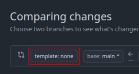

## Github Template Picker - Chrome Extension

A chrome extension that allows you to pick pull request templates from a dropdown menu.

## Installation

1. Clone this repository
2. Modify the `config.json` for the templates of your repo. 
2. Go to `chrome://extensions/` in your browser, or Goto: `settings` > `extensions` > `manage extension` 
3. Click on `Load unpacked` and select the cloned repository

## Config

```json
{
    "cat-lover-4000/cat-pictures": ["adding-a-cute-cat.md", "adding-a-fat-cat.md"],
    "another-user/another-repo": ["template1.md", "template2.md", "template3.md"]
}

```

## FAQ

### Q. Where is the button?

On the pull request creation page (Titled: **Comparing changes**) there will be a drop down menu where you can select your templates.




### Q. How do Github PR templates work? 

https://docs.github.com/en/communities/using-templates-to-encourage-useful-issues-and-pull-requests/creating-a-pull-request-template-for-your-repository